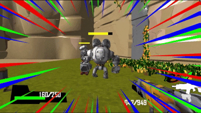
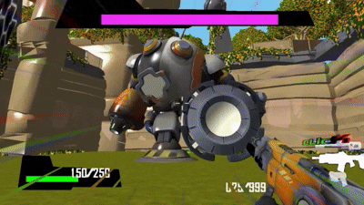
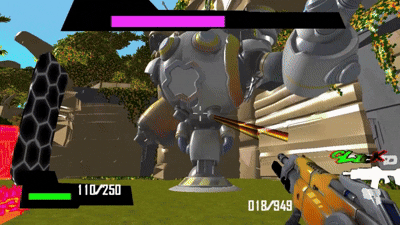
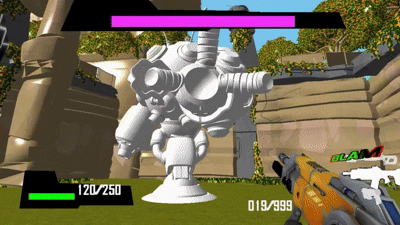
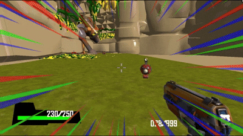
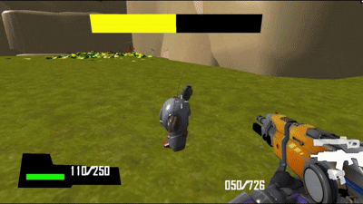

<!-- 기술 배지 -->

# RoboQuest 개인 프로젝트 (DirectX11 기반 FPS 게임)

## ■ 개요
- RoboQuest는 FPS 기반 보스전 중심 슈팅 게임입니다.
- **C++ / DirectX11 / HLSL / ImGui / Windows API 기반으로 자체 엔진을 사용하여 제작한 개인 프로젝트입니다.**

## ■ 개발 환경
- 언어 : C++, HLSL
- 개발 도구 : Visual Studio, Windows API, DirectX11, ImGui, Fmod
- 그래픽 API : DirectX 11
- 개발 인원 : 1 명
- 개발 기간 : 2024.11 ~ 2025.01

## ■ 시연 영상
- [RoboQuest 시연 영상](https://youtu.be/q8If1wbsMpg)

## ■ 기술 소개서 PDF 링크, 코드 
- [프로젝트 기술소개서 PDF](https://drive.google.com/file/d/1XK15oVdcmxTyI4i41KBMDthWzwBV1F3H/view?usp=drive_link)

## ■ 핵심 프로젝트 구조

<pre>
📂 <b>Client</b>
└── 📂 <b>Private</b>
    ├── <a href="./Client/Private/CMonster.cpp">Monster.cpp</a>
    │   ├── <a href="./Client/Private/Boss_Tower.cpp">Boss_Tower.cpp</a>
    │   └── <a href="./Client/Private/Robo_Goliath.cpp">Robo_Goliath.cpp</a>
    ├── <a href="./Client/Private/CPlayer.cpp">Player.cpp</a>
    │   ├── <a href="./Client/Private/Player_Camera.cpp">Player_Camera.cpp</a>
    │   ├── <a href="./Client/Private/Gun.cpp">Gun.cpp</a>
    │   │   └── <a href="./Client/Private/Sniper.cpp">Sniper.cpp</a>
    │   └── <a href="./Client/Private/Body_Player.cpp">Body_Player.cpp</a>
    ├── <a href="./Client/Private/Item.cpp">Item.cpp</a>
    │   └── <a href="./Client/Private/WeaponItem.cpp">WeaponItem.cpp</a>
    ├── <a href="./Client/Private/Bullet.cpp">Bullet.cpp</a>
    │   └── <a href="./Client/Private/Bullet_Rifle.cpp">Bullet_Rifle.cpp</a>
    ├── <a href="./Client/Private/Missile.cpp">Missile.cpp</a>
    │   ├── <a href="./Client/Private/Missile_Boss.cpp">Missile_Boss.cpp</a>
    │   └── <a href="./Client/Private/Missile_Goliath.cpp">Missile_Goliath.cpp</a>
    ├── -----------------------------
    ├── ------ <b>Effect</b> ------
    ├── <a href="./Client/Private/DashEffect.cpp">DashEffect.cpp</a>
    ├── <a href="./Client/Private/HurtEffect.cpp">HurtEffect.cpp</a>
    └── <a href="./Client/Private/BurnEffect.cpp">BurnEffect.cpp</a>

📂 <b>Engine</b>
└── 📂 <b>Private</b>
    ├── <a href="./Engine/Private/Model.cpp">Model.cpp</a>
    ├── <a href="./Engine/Private/Mesh.cpp">Mesh.cpp</a>
    ├── <a href="./Engine/Private/Navigation.cpp">Navigation.cpp</a>
    ├── <a href="./Engine/Private/EdgeNavi.cpp">EdgeNavi.cpp</a>
    └── <a href="./Engine/Private/Cell.cpp">Cell.cpp</a>

📂 <b>ShaderFiles</b>
├── <a href="./Client/Bin/ShaderFiles/Shader_VtxRoboHpBarTex.hlsl">Shader_VtxRoboHpBarTex.hlsl</a>
├── <a href="./Client/Bin/ShaderFiles/Shader_VtxSmokeParticleEffect.hlsl">Shader_VtxSmokeParticleEffect.hlsl</a>
├── <a href="./Client/Bin/ShaderFiles/Shader_VtxLaserMesh.hlsl">Shader_VtxLaserMesh.hlsl</a>
└── <a href="./Client/Bin/ShaderFiles/Shader_VtxBarreirTex.hlsl">Shader_VtxBarreirTex.hlsl</a>
</pre>

## ■ 주요 구현 기능

### 1. FPS 조작 시스템
- **RayCast**를 활용한 정밀 슈팅 구현
- 슬롯 기반 **무기 스왑 시스템**
- **스나이퍼 모드 줌인**: 마우스 우클릭 시 카메라의 **FOV(Field of View)** 값을 줄여서 시야를 좁히고 화면 확대 효과 구현
- 플레이어 슈팅 시 총알 발사 이펙트 및 피격 판정 처리

### 2. 플레이어 컨트롤
- 기본 조작: **WASD 이동**, **대쉬**, **점프**, **슈팅**, **장전**
- **장전 시 탄약 UI**와 실시간 연동
- 모든 조작은 FSM(상태 기반) 구조로 처리

### 3. 몬스터 AI
- **Navigation 영역 기반 경로 이동** 구현
- **감지 → 추적 → 공격 → 사망** 상태 전이 설계
- 공격 시 플레이어를 추적하여 근접/원거리 공격 수행
- 사망 시 **디졸브 셰이더**를 이용한 시각적 연출 구현

### 4. 보스 AI
- 보스 등장을 알리는 **전용 연출 + 전용 UI 패널** 구현
- 총 **4가지 보스 공격 패턴** 구현:
  1. 플레이어 위치를 향한 직선 미사일 연사
  2. 플레이어를 향해 **베지어 곡선 경로**로 날아가는 포탄 공격
  3. **화염 지대 필드 생성**으로 이동 제한 및 대미지 영역 형성
  4. **방패 소환**을 통한 플레이어 슈팅 차단 (총알 무효화)

| 보스 공격 패턴 1 (직선 사격) | 보스 공격 패턴 2 (베지어 곡선) | 보스 공격 패턴 3 (방패 소환) |
| :---: | :---: | :---: |
|  |  |  |

### 5. UI 연출
- **체력 UI**, **유닛 HP 연동 UI**, **무기 탄약 UI** 구현
- **직교 투영 기준 체력/빌보드 처리**로 월드 오브젝트와 연동
- 상호작용에 대응하는 **폰트 기반 안내 UI**도 구성

### 6. 이펙트 처리
- **총알 트레일** 및 **피격 시 탄환 반응 이펙트**
- **대쉬 상태에서 반투명 잔상 이펙트** 적용
- 플레이어 피격 시 붉은 화면 효과와 함께 시각적 경고 연출
- 총격 시 **"BANG"** 텍스트 이펙트 출력

---

## ■ 구현 파트 핵심 요약
- FPS 조작 시스템 (RayCast 기반 슈팅, 무기 전환, FOV 줌인)
- 플레이어 FSM 입력 처리 및 상태별 전이 구현
- 몬스터 AI: 상태 전이, 경로 추적, 디졸브 사망 연출
- 보스 AI: 4패턴 FSM + UI/연출 동기화
- 실시간 HUD 구성 (체력, 탄약, 빌보드 HP, 상호작용 UI)
- 슈팅/피격/이동 상황별 이펙트 출력

---
